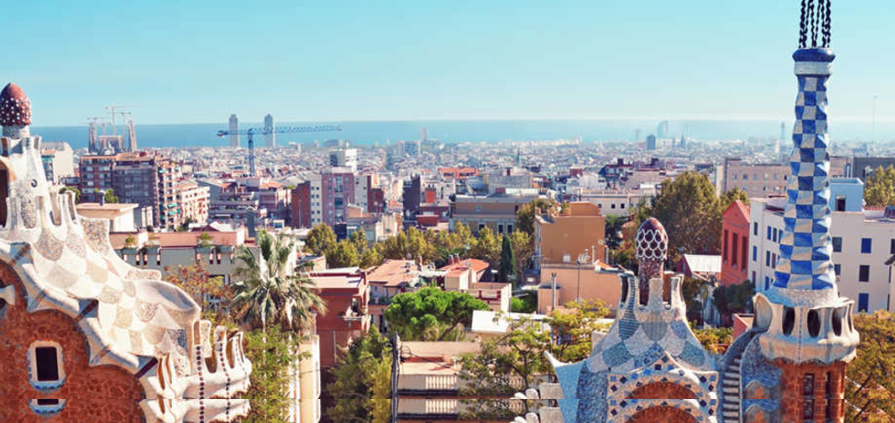
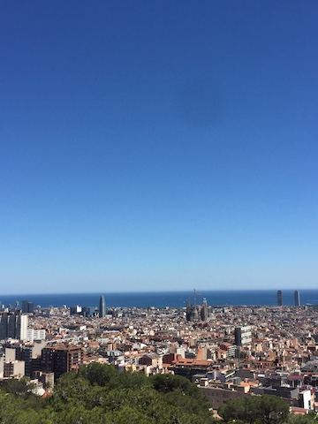
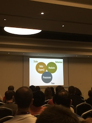
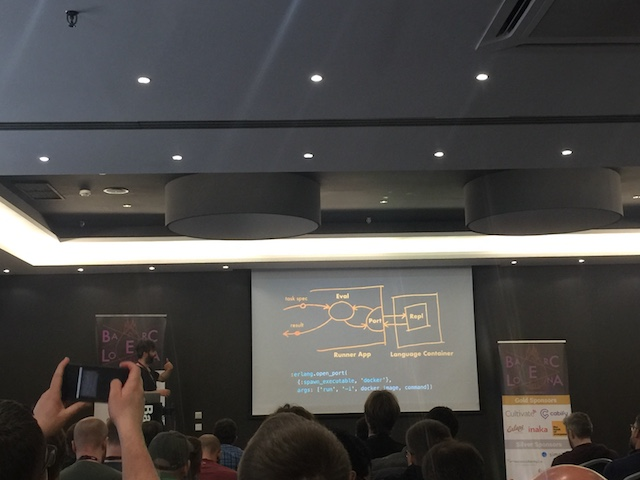
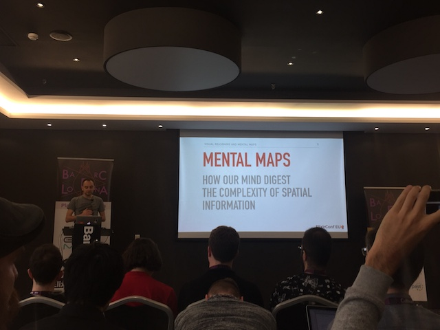
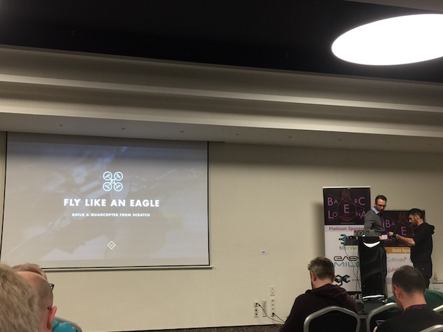
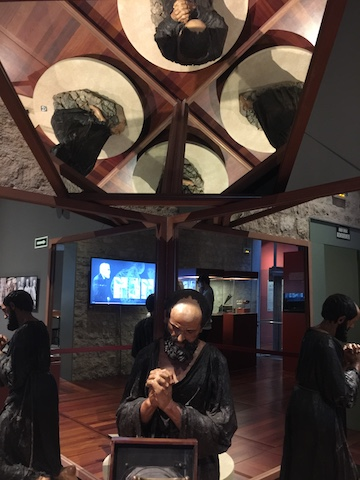
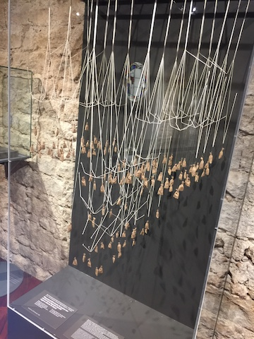
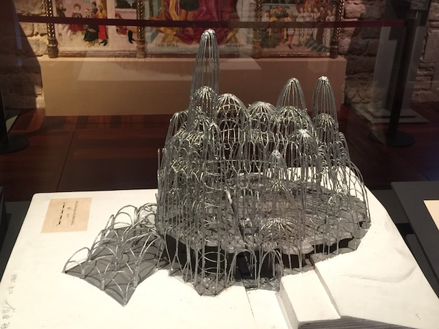
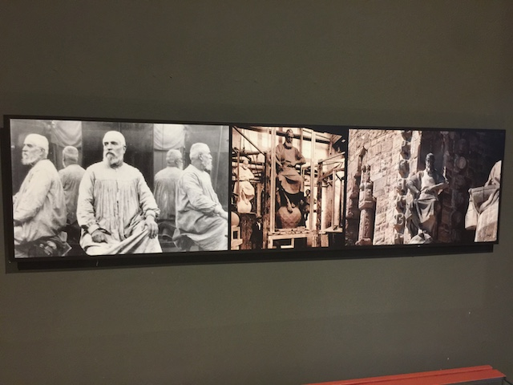

<!-- $theme: default -->
<!-- page_number: true -->


# My First Elixir Conf

### @jaigouk

#### 11.05.2017

---

# Agenda

1. First time in Spain
2. Talks I enjoyed
3. Gaudi experience
4. What I learned

---

# Spain!

Support from Blacklane.com, I was able to attend elixir conf eu 2017

## thanks to blacklane

 

---

# Talks I enjoyed

### keynote


```elixir
#state.behavior
dictionary.store("key", "val")
#time is coupbled with state
```
in elixir, state goes to data(types) and modules are responsible for behaviors. Processes will deal with time related parts.

---


# Talks I enjoyed

### Elixir Berlin

I recommended Andrea Amantini's talk. and Daniel's visualization talks to my colleagues.

### "A Practical Guide to Protocols" 

it was easy to understand and yet it is a powerful tool for projects.


---

# Talks I enjoyed



Daniel

https://github.com/digitalnatives/paparazzi

there is an alternative that you can visualize your projects. http://www.erlang.pl/

---


# Talks I enjoyed

### nerves project related talks!

[@loicvigneron](https://twitter.com/loicvigneron) showed us his project in detail and visually as possible. I will playy with SSDP discovery.  

https://github.com/elicopter

### high availability
@cloud8421. I thought that if I use phoenix, then that will be there by default. but he told us that we have to design our availability. he said "It doesn't just happen". 

---


# Talks I enjoyed

* GraphQL talk 

* phoenix 

```elixir
gauge(:active_users, every: {5, :minutes}),

def active_users(_state) do
  count =
    Repo.one(from u in User,
      select: count(u.id),
      where: u.last_request_at >= ago(5, "minute"))
  {:ok, count, state}
end
```

---


# Gaudi

---


# Gaudi

 

---


# Gaudi


---


# Gaudi


---


# What I learned

### 1. Buy tickets 1 day before at least
### 2. Cross field approach. we can learn from other field. 


